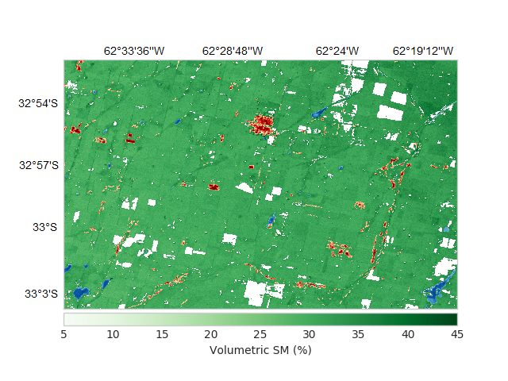
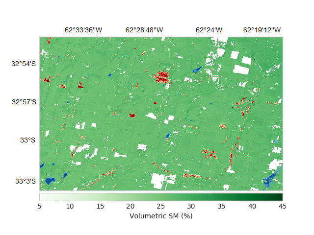
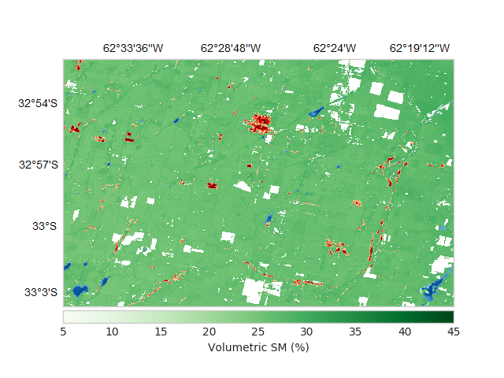

# Soil-Moisture-and-Evapotranspirations-Maps

Description: 

Generates maps of SM or ET from satellite images and the application of different models. 
The application of the model is basically performing matrix operations. Previously, satellite 
images must be modified to obtain the same projections and spatial resolutions.

Spatial resolutions are changed using reprojection operations based on interpolations of the type:

    -Nearest Neighbour
    -Bilinear
    -Cubic
    -Average

are used.

Evapotranspiration maps examples:

- 36 km spatial resolucion (ET observada, ET modelada y Error):

  
  
  

Soil moisture maps examples:
- 30 m spatial resolucion (Multiple linear regression, Multilayer perceptron and Multivariate adaptive regression splines models):

  
  
  

...

Dependences:

    python - sklearn
    python - mpl_toolkits
    python - skimage
    python - NumPy
    python - Matplolib
    python - Gdal

